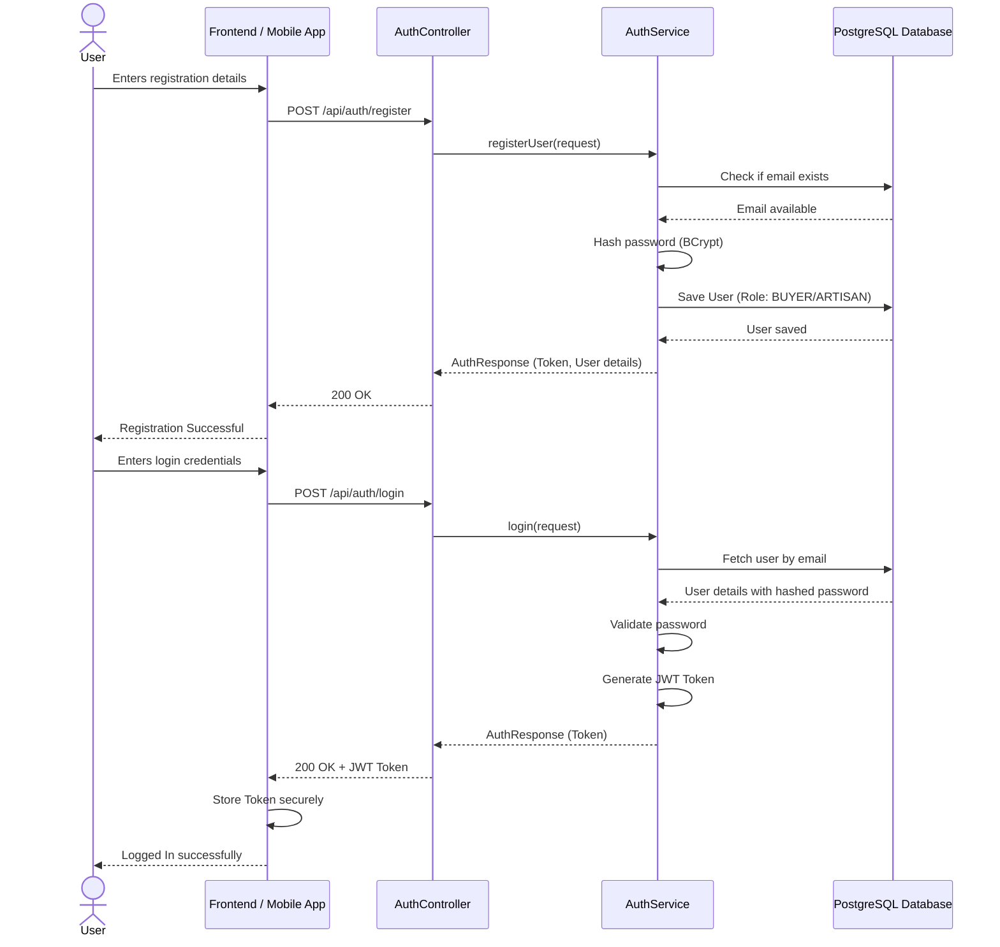
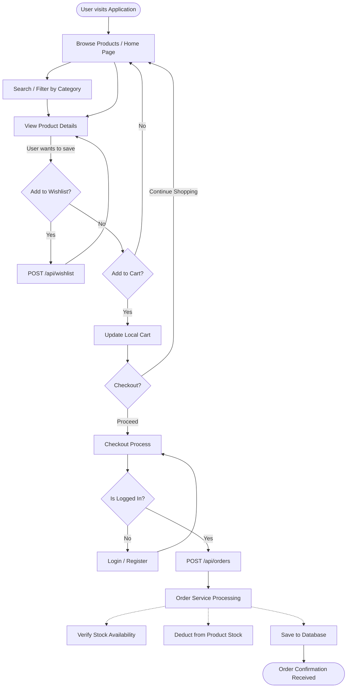
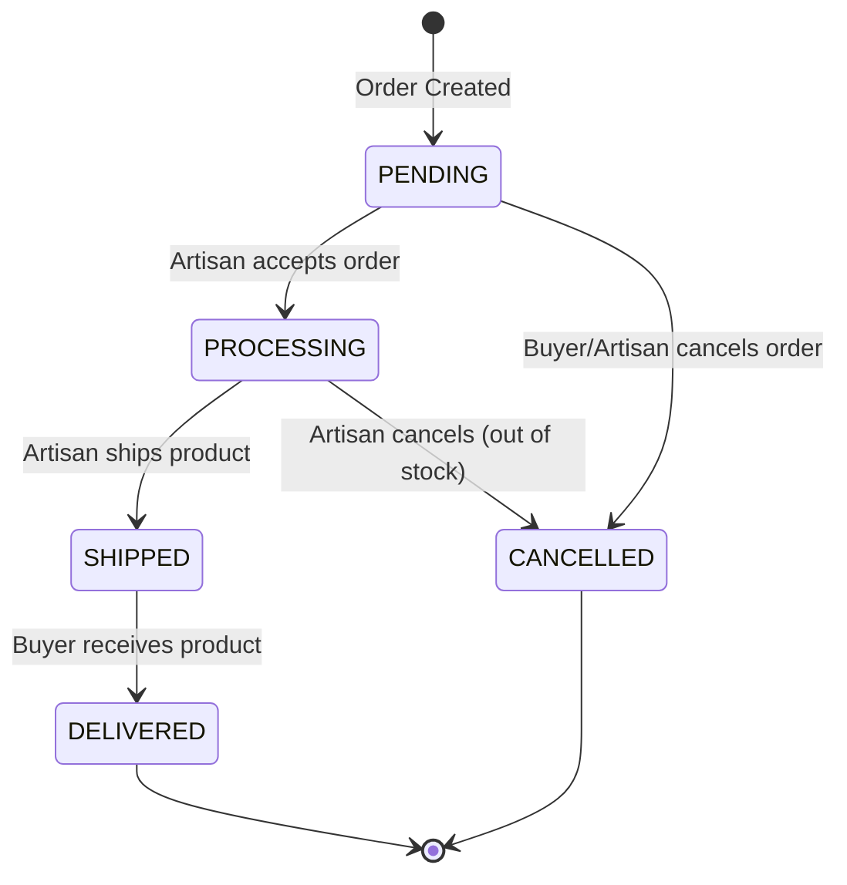
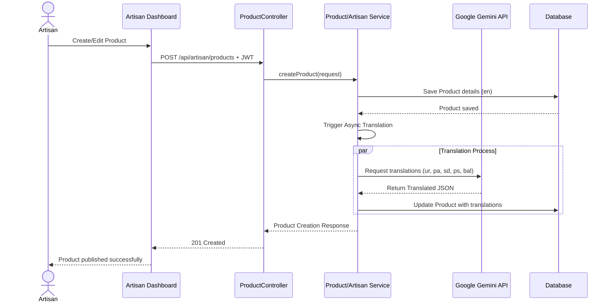
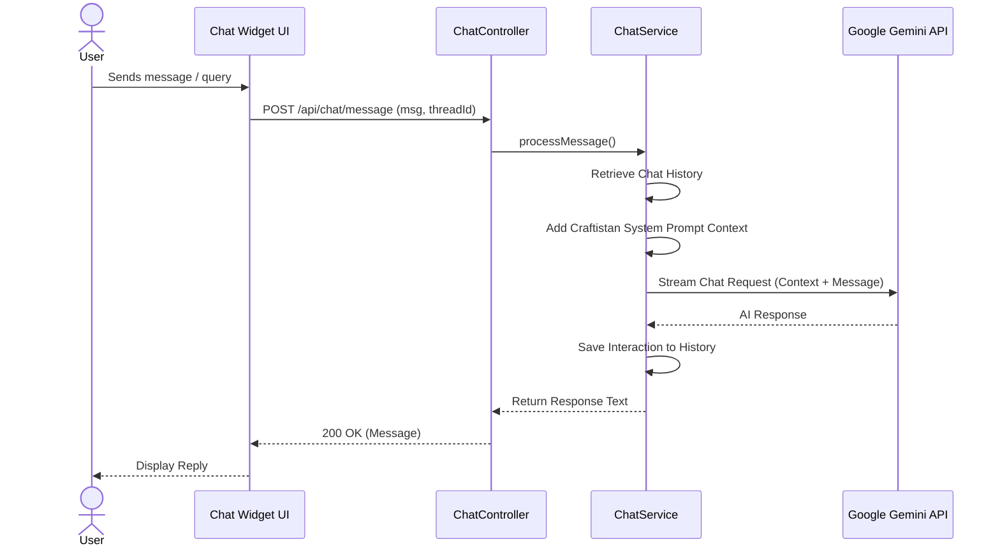

# Craftistan - Flow and User Interaction Diagrams

This document contains Mermaid diagrams illustrating the key user interactions and system flows within the Craftistan E-Commerce Platform.

## 1. User Registration & Authentication Flow

This sequence diagram shows how a user interacts with the system to register and authenticate, receiving a JWT token for subsequent requests.



## 2. Customer Shopping Flow (Browsing to Checkout)

This flowchart illustrates the end-to-end shopping experience for a Buyer interactively browsing products, managing their cart, and creating an order.



## 3. Order Lifecycle (State Machine)

This state diagram shows the states an order goes through from placement to delivery, primarily driven by the Artisan and System updates.



## 4. Artisan Product Management Interaction

This sequence diagram depicts an Artisan managing their products on the platform, including the automated translation feature.



## 5. User Review & Verification Flow

This diagram defines how a user leaves a review and how the system validates if they actually purchased the item to grant a "Verified Purchase" badge.

```mermaid
flowchart LR
    User([User]) -->|Submits Review & Rating| SubmitReview
    SubmitReview[POST /api/products/{id}/reviews] --> Validation{Has User Ordered Product?}
    
    Validation -->|Yes| CheckStatus{Is Order DELIVERED?}
    Validation -->|No| RejectReview[Reject Review\nReturn 403 Forbidden]
    
    CheckStatus -->|Yes| SaveVerified[Save Review\nSet Verified = True]
    CheckStatus -->|No| SaveUnverified[Save Review\nSet Verified = False]
    
    SaveVerified --> UpdateRating[Update Product Average Rating]
    SaveUnverified --> UpdateRating
    
    UpdateRating --> Success([Return Success to User])
    RejectReview --> Error([Show Error to User])
```

## 6. AI Chatbot Support Interaction

This sequence diagram shows how a user interacts with the AI-powered customer support chatbot feature available on Craftistan.


